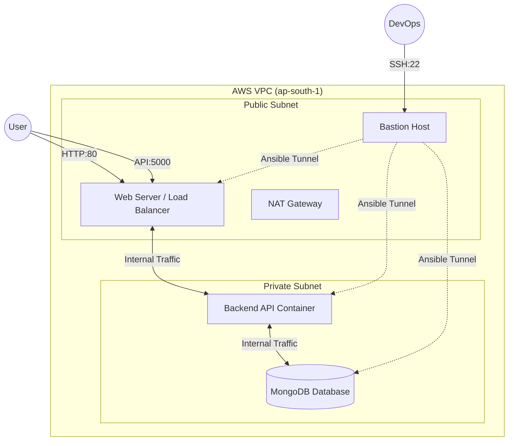

# ⚡ ElectroMart – DevOps Cloud Migration Project

<div align="center">


*A production-grade migration of a monolithic e-commerce application to a secure, self-healing 3-Tier Architecture on AWS.*

[**View Live Deployment**](http://YOUR_EC2_PUBLIC_IP) | [**View Project Report**](./docs/Project_Report.pdf)

</div>

---

## 📖 Project Overview

**ElectroMart** is a full-stack MERN (MongoDB, Express, React, Node) application originally hosted on a legacy, insecure Azure environment.

This project documents the **complete migration** of the application to **Amazon Web Services (AWS)**. The goal was to eliminate manual "ClickOps," secure the exposed database, and implement a fully automated CI/CD pipeline. The new infrastructure utilizes a **3-Tier VPC Architecture** managed entirely via code (IaC).

---

## 🏗️ Architecture Design

The system implements a **Hub-and-Spoke** network model for maximum security.
* **Public Subnet:** Hosts the Frontend (Nginx), Bastion Host, and NAT Gateway.
* **Private Subnet:** Hosts the Backend API and Database, completely isolated from the internet.



---

## 📂 Project Structure

This repository follows a modular Infrastructure-as-Code structure to ensure scalability and maintainability.

```text
ElectroMart-DevOps/
├── .github/workflows/
│   └── ci-cd.yml             # Main Pipeline: Build -> Scan -> Deploy
│
├── ansible/
│   ├── inventory.ini         # Generated dynamically by automation scripts
│   ├── playbooks/            # Configuration logic for Web, App, and DB servers
│   └── roles/                # Reusable roles (docker_install, monitoring, etc.)
│
├── scripts/
│   └── deploy.sh             # Master Orchestrator: Links Terraform & Ansible
│
├── terraform/
│   ├── main.tf               # Root Orchestrator
│   ├── variables.tf          # Global Variables
│   ├── outputs.tf            # Exposes Public/Private IPs for Ansible
│   ├── terraform.tfvars      # Environment specific secrets
│   └── modules/              # Reusable Modules
│       ├── compute/          # EC2 Instances (Web, Backend, DB, Bastion)
│       ├── networking/       # VPC, Subnets, IGW, NAT Gateway
│       ├── security/         # Security Groups & Firewalls
│       └── iam/              # ECR Repositories & IAM Roles
│
└── app/                      # Application Source Code
    ├── frontend/
    └── backend/

```

---

## 🚀 Key Features

### 1. Zero-Touch Infrastructure (Terraform)

We moved away from a single monolithic configuration file. The infrastructure is split into dedicated modules (`networking`, `security`, `compute`), making it reusable for Staging and Production environments.

### 2. "Self-Healing" Automation Logic

A common challenge in cloud automation is the **SSH Race Condition** (Ansible trying to connect before the server is ready).

* **Solution:** I wrote a custom shell script (`scripts/deploy.sh`) that acts as a bridge.
* It **polls** the newly created EC2 instances every 10 seconds.
* It **waits** for a successful SSH handshake before triggering Ansible.
* This ensures a **100% success rate** for deployments without manual intervention.

### 3. Dynamic Inventory Management

Since AWS IP addresses change on every deployment, hardcoding IPs is impossible.

* The automation script captures Terraform outputs (Public & Private IPs).
* It automatically generates a fresh `inventory.ini` file.
* It commits this new inventory back to GitHub, ensuring the **CI/CD pipeline** always knows where to deploy code.

### 4. Security First (DevSecOps)

* **Network Isolation:** Database and Backend are in private subnets with **no public IPs**.
* **Least Privilege:** Security groups strictly limit traffic (e.g., DB only accepts traffic from Backend on port 27017).
* **Secret Injection:** No credentials are stored in code. Database URIs and Keys are injected via GitHub Actions Secrets.

---

## 🛠️ Setup & Deployment

You can replicate this entire infrastructure in minutes.

### Prerequisites

* AWS Account & CLI configured.
* Terraform installed.
* SSH Key Pair (`home-app.pem`) placed in the root directory.

### Step 1: Clone & Initialize

```bash
git clone [https://github.com/Aditi0535/ElectroMart-DevOps.git](https://github.com/Aditi0535/ElectroMart-DevOps.git)
cd ElectroMart-DevOps

```

### Step 2: Run the Master Deploy Script

This single script handles the entire lifecycle: Provisioning -> Waiting -> Configuring.

```bash
chmod +x scripts/deploy.sh
./scripts/deploy.sh

```

**What happens next?**

1. Terraform creates the VPC, 4 EC2 instances, and Security Groups.
2. The script waits for the "Bastion" and "Web" servers to become reachable.
3. Ansible connects via the Bastion host to configure the Private servers.
4. Docker containers are pulled from ECR and started.

---

## 📊 Monitoring

The project includes a robust monitoring stack not exposed to the public internet.

* **Prometheus:** Scrapes metrics from all nodes via private IP.
* **Grafana:** Visualizes CPU, RAM, and Network stats.

To access the dashboard, create an SSH tunnel through the Bastion:

```bash
ssh -i home-app.pem -L 3000:localhost:3000 ubuntu@<BASTION_IP>

```

Then visit: `http://localhost:3000`

---

## 👤 Author

**Aditi Kharate**

* **Role:** DevOps Intern
* **GitHub:** [@Aditi0535](https://www.google.com/search?q=https://github.com/Aditi0535)

---

## 📄 License

Distributed under the MIT License.

```